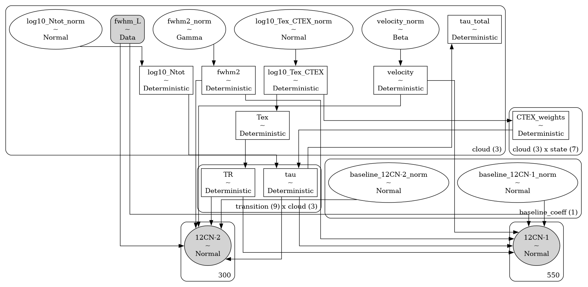
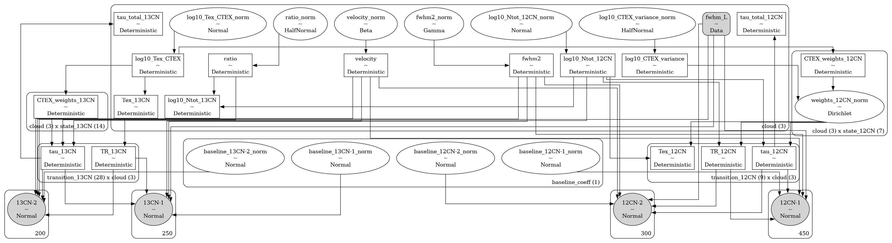

# bayes_hfs <!-- omit in toc -->


[](https://bayes-hfs.readthedocs.io/en/latest/?badge=latest)
[](https://codecov.io/gh/tvwenger/bayes_hfs)

A Bayesian Molecular Hyperfine Spectroscopy Model

`bayes_hfs` implements a probabilistic model to infer the physics of the interstellar medium from molecular hyperfine spectroscopy observations.

This replaces a similar model tuned for CN and $^{13}$CN hyperfine spectroscopy observations called [`bayes_cn_hfs`](https://github.com/tvwenger/bayes_ch_hfs). `bayes_hfs` aims to be a more general purpose model.

- [Installation](#installation)
  - [Basic Installation](#basic-installation)
- [Notes on Physics \& Radiative Transfer](#notes-on-physics--radiative-transfer)
- [Models](#models)
  - [Model Notes](#model-notes)
  - [`HFSModel`](#hfsmodel)
  - [`HFSRatioModel`](#hfsratiomodel)
- [Syntax \& Examples](#syntax--examples)
- [Issues and Contributing](#issues-and-contributing)
- [License and Copyright](#license-and-copyright)


# Installation

## Basic Installation

Install with `pip` in a `conda` virtual environment:
```
conda create --name bayes_hfs -c conda-forge pymc pip
conda activate bayes_hfs
# Due to a bug in arviz, this fork is temporarily necessary
# See: https://github.com/arviz-devs/arviz/issues/2437
pip install git+https://github.com/tvwenger/arviz.git@plot_pair_reference_labels
pip install bayes_hfs
```

# Notes on Physics & Radiative Transfer

All models in `bayes_hfs` apply the same physics and equations of radiative transfer.

The transition optical depth and source function are taken from [Magnum & Shirley (2015) section 2 and 3](https://ui.adsabs.harvard.edu/abs/2015PASP..127..266M/abstract).

The radiative transfer is calculated explicitly assuming an off-source background temperature `bg_temp` (see below) similar to [Magnum & Shirley (2015) equation 23](https://ui.adsabs.harvard.edu/abs/2015PASP..127..266M/abstract). By default, the clouds are ordered from *nearest* to *farthest*, so optical depth effects (i.e., self-absorption) may be present. We do not assume the Rayleigh-Jeans limit; the source radiation temperature is predicted explicitly and can account for observation effects, i.e., the models can predict brightness temperature ($T_B$) or corrected antenna temperature ($T_A^*$).

Non-constant excitation temperature (CTEX) effects are modeled by considering the column densities of all states and self-consistently solving for the excitation temperature of each transition.

For the `HFSRatioModel`, we can either assume or not assume CTEX for either species. If both species do not assume CTEX, then the CTEX variance hyperparameter is shared between species.

Notably, since these are *forward models*, we do not make assumptions regarding the optical depth or the Rayleigh-Jeans limit. These effects, and the subsequent degeneracies and biases, are *predicted* by the model and thus *captured* in the inference. 

# Models

The models provided by `bayes_hfs` are implemented in the [`bayes_spec`](https://github.com/tvwenger/bayes_spec) framework. `bayes_spec` assumes that the source of spectral line emission can be decomposed into a series of "clouds", each of which is defined by a set of model parameters. Here we define the models available in `bayes_hfs`.

## Model Notes

1. The `velocity` of a cloud can be challenging to identify when spectral lines are narrow and widely separated. We overcome this limitation by modeling the line profiles as a "pseudo-Voight" profile, which is a linear combination of a Gaussian and Lorentzian profile. The parameter `fwhm_L` is a latent hyper-parameter (shared among all clouds) that characterizes the width of the Lorentzian part of the line profile. When `fwhm_L` is zero, the line is perfectly Gaussian. This parameter produces line profile wings that may not be physical but nonetheless enable the optimization algorithms (i.e, MCMC) to converge more reliably and efficiently. Model solutions with non-zero `fwhm_L` should be scrutinized carefully. This feature can be turned off by supplying `None` (default) to `prior_fwhm_L`, in which case the line profiles are assumed Gaussian.
2. Hyperfine anomalies are treated as deviations from the LTE populations of each state. The value passed to `prior_log10_Tex_CTEX` sets the CTEX statistical weights, `CTEX_weights`. Deviations from these weights are modeled as a Dirichlet distribution with a concentration parameter `len(states) * CTEX_weights / 10**log10_CTEX_variance`, where `log10_CTEX_variance` is a cloud parameter that describes the scatter in state weights around the LTE values. A small `log10_CTEX_variance` implies a large concentration around `CTEX_weights`.
3. To prevent masers, which have a different equation of radiative transfer than is assumed by the model, we clip the statistical weights to be in the range `[clip_weights, 1.0 - clip_weights]` (i.e., the weights can't be 0 or 1), and we clip the optical depth below `clip_tau`.

## `HFSModel`

The basic model is `HFSModel`, a general purpose model for modelling molecular hyperfine spectroscopic observations. The model assumes that the emission can be explained by the radiative transfer of emission through a series of isothermal, homogeneous clouds as well as a polynomial spectral baseline. The following diagram demonstrates the relationship between the free parameters (empty ellipses), deterministic quantities (rectangles), model predictions (filled ellipses), and observations (filled, round rectangles). Many of the parameters are internally normalized (and thus have names like `_norm`). The subsequent tables describe the model parameters in more detail.



| Cloud Parameter<br>`variable` | Parameter                                              | Units    | Prior, where<br>($p_0, p_1, \dots$) = `prior_{variable}`                  | Default<br>`prior_{variable}` |
| :---------------------------- | :----------------------------------------------------- | :------- | :------------------------------------------------------------------------ | :---------------------------- |
| `log10_Ntot`                  | Total column density across all upper and lower states | `cm-2`   | $\log_{10}N_{\rm tot} \sim {\rm Normal}(\mu=p_0, \sigma=p_1)$             | `[13.5, 0.25]`                |
| `fwhm2`                       | Square FWHM line width                                 | `km s-1` | $\Delta V^2 \sim ChiSquared(\nu=1)$                                       | `1.0`                         |
| `velocity`                    | Velocity (same reference frame as data)                | `km s-1` | $V \sim p[0] + p[1] {\rm Beta}(\alpha=2, \beta=2)$                        | `[-10.0, 10.0]`               |
| `log10_Tex_CTEX`              | CTEX excitation temperature                            | `K`      | $\log_{10}T_{{\rm ex}, ul} \sim {\rm Normal}(\mu=p_0, \sigma=p_1)$        | `[0.75, 0.1]`                 |
| `log10_CTEX_variance`         | CTEX variance                                          | ``       | $\log_{10} \sigma_{\rm CTEX}^2 \sim p[0] + {\rm HalfNormal}(\sigma=p[1])$ | `[-4.0, 1.0]`                 |

The `log10_CTEX_variance` parameter is only relevant when `assume_CTEX` is `False`. Otherwise, all transitions are assumed to have the same excitation temperature.

| Hyper Parameter<br>`variable` | Parameter                                   | Units    | Prior, where<br>($p_0, p_1, \dots$) = `prior_{variable}` | Default<br>`prior_{variable}` |
| :---------------------------- | :------------------------------------------ | :------- | :------------------------------------------------------- | :---------------------------- |
| `fwhm_L`                      | Lorentzian FWHM line width                  | `km s-1` | $\Delta V_{L} \sim {\rm HalfNormal}(\sigma=p)$           | `None`                        |
| `baseline_coeffs`             | Normalized polynomial baseline coefficients | ``       | $\beta_i \sim {\rm Normal}(\mu=0.0, \sigma=p_i)$         | `[1.0]*baseline_degree`       |

## `HFSRatioModel`

`bayes_hfs` also implements `HFSRatioModel`, a model to infer the column density ratio between two species under the assumption that they originate in the same slabs. Different assumptions about the excitation conditions can be made.



| Cloud Parameter<br>`variable` | Parameter                                       | Units    | Prior, where<br>($p_0, p_1, \dots$) = `prior_{variable}`                          | Default<br>`prior_{variable}` |
| :---------------------------- | :---------------------------------------------- | :------- | :-------------------------------------------------------------------------------- | :---------------------------- |
| `log10_Ntot1`                 | Total column density of the first species       | `cm-2`   | $\log_{10}N_{\rm tot, 1} \sim {\rm Normal}(\mu=p_0, \sigma=p_1)$                  | `[13.5, 0.25]`                |
| `ratio`                       | Column density ratio of second to first species | ``       | $\log_{10}N_{\rm tot, 2}/\log_{10}N_{\rm tot, 1} \sim {\rm HalfNormal}(\sigma=p)$ | `0.1`                         |
| `fwhm2`                       | Square FWHM line width                          | `km s-1` | $\Delta V^2 \sim ChiSquared(\nu=1)$                                               | `1.0`                         |
| `velocity`                    | Velocity (same reference frame as data)         | `km s-1` | $V \sim p[0] + p[1] {\rm Beta}(\alpha=2, \beta=2)$                                | `[-10.0, 10.0]`               |
| `log10_Tex_CTEX`              | CTEX excitation temperature                     | `K`      | $\log_{10}T_{{\rm ex}, ul} \sim {\rm Normal}(\mu=p_0, \sigma=p_1)$                | `[0.75, 0.1]`                 |
| `log10_CTEX_variance`         | CTEX variance                                   | ``       | $\log_{10} \sigma_{\rm CTEX}^2 \sim p[0] + {\rm HalfNormal}(\sigma=p[1])$         | `[-4.0, 1.0]`                 |

The `log10_CTEX_variance` parameter is only relevant when either `assume_CTEX1` is `False` or `assume_CTEX2` is `False`. If they are both `False`, then both species are assumed to be drawn from the same distribution of state densities set by the `log10_CTEX_variance` parameter.

| Hyper Parameter<br>`variable` | Parameter                                   | Units    | Prior, where<br>($p_0, p_1, \dots$) = `prior_{variable}` | Default<br>`prior_{variable}` |
| :---------------------------- | :------------------------------------------ | :------- | :------------------------------------------------------- | :---------------------------- |
| `fwhm_L`                      | Lorentzian FWHM line width                  | `km s-1` | $\Delta V_{L} \sim {\rm HalfNormal}(\sigma=p)$           | `None`                        |
| `baseline_coeffs`             | Normalized polynomial baseline coefficients | ``       | $\beta_i \sim {\rm Normal}(\mu=0.0, \sigma=p_i)$         | `[1.0]*baseline_degree`       |

# Syntax & Examples

See the various tutorial notebooks under [docs/source/notebooks](https://github.com/tvwenger/bayes_hfs/tree/main/docs/source/notebooks). Tutorials and the full API are available here: https://bayes-hfs.readthedocs.io.

# Issues and Contributing

Anyone is welcome to submit issues or contribute to the development
of this software via [Github](https://github.com/tvwenger/bayes_hfs).

# License and Copyright

Copyright(C) 2024-2025 by Trey V. Wenger

This code is licensed under MIT license (see LICENSE for details)